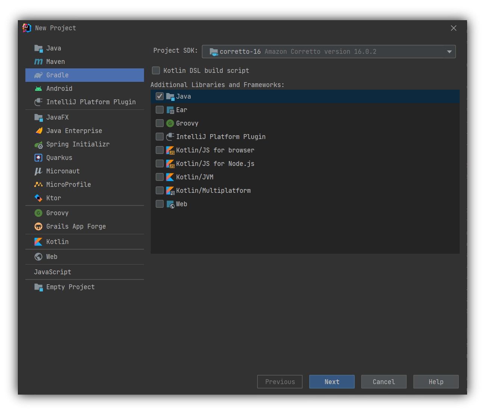
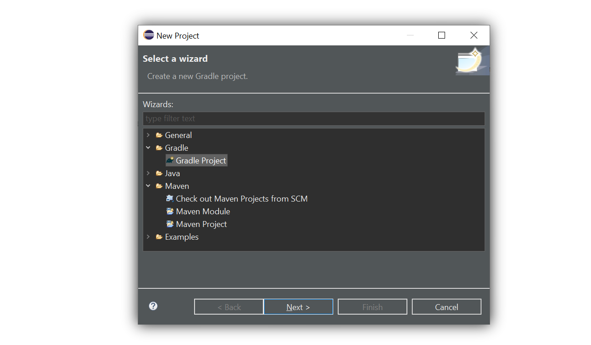

# Getting started
## Setting up your environment
Before you can start developing, first you will need to set up your development environment. You can use a modern IDE like [IntelliJ IDEA](https://www.jetbrains.com/idea/) or [Eclipse](https://www.eclipse.org/) to get started quickly.

=== "IntelliJ IDEA"
    Select the `File` menu, then `New -> Project...`. A dialog will appear. In this dialog, select either `Maven` or `Gradle`:  
      
    Next follow the instructions in the dialog to create your project.
=== "Eclipse"
    Select the `File` menu, then `New -> New Project...`. A dialog will appear. In this dialog, select the `Maven` folder and then `Maven Project`, or select the `Gradle` folder and then `Gradle Project`:
      
    Next follow the instructions in the dialog to create your project.


### Maven configuration
Each module has its own dedicated dependency, so you have the freedom to use only the modules you actually need. To get started, add the Maven dependencies as displayed below. A complete list of modules can be found on [Maven Central](https://search.maven.org/search?q=org.dockbox.hartshorn){:target="_blank"}.
!!! warning "Note"
    Official Hartshorn modules are always published with the Group ID `org.dockbox.hartshorn`. Artifacts with other Group IDs are not officially supported.

=== "Maven"
    ```xml title="pom.xml"
    <dependency>
      <groupId>org.dockbox.hartshorn</groupId>
      <artifactId>hartshorn-core</artifactId>
      <version>${version}</version>
    </dependency>
    ```
=== "Gradle"
    ```groovy title="build.gradle"
    implementation "org.dockbox.hartshorn:hartshorn-core:$version"
    ```
=== "Other"
    Hartshorn can be found on Maven Central at [org.dockbox.hartshorn/hartshorn-core](https://search.maven.org/artifact/org.dockbox.hartshorn/hartshorn-core){:target="_blank"}
